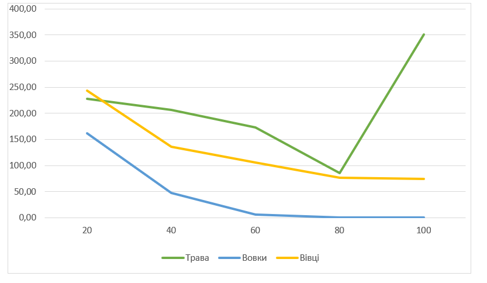
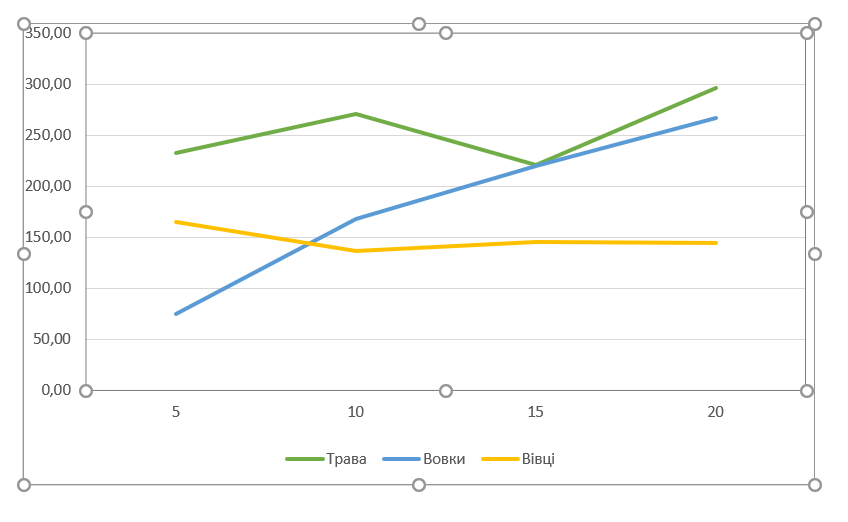
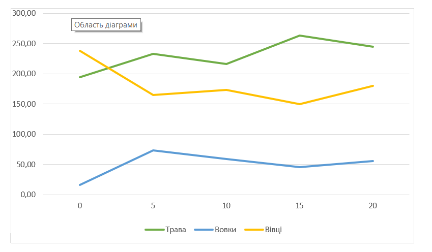

## Комп'ютерні системи імітаційного моделювання
## СПм-23-5, **Чхеідзе Важа Олександрович**
### Лабораторна робота №**1**. Опис імітаційних моделей та проведення обчислювальних експериментів

 

### Варіант 7, модель у середовищі NetLogo:
[Wolf Sheep Predation](http://www.netlogoweb.org/launch#http://www.netlogoweb.org/assets/modelslib/Sample%20Models/Biology/Wolf%20Sheep%20Predation.nlogo).

 

### Вербальний опис моделі:
Ця модель досліджує стабільність екосистеми хижак-жертва. Така система називається нестабільною, якщо вона має тенденцію призводити до вимирання одного або кількох видів. Навпаки, система є стабільною, якщо вона прагне підтримувати себе протягом тривалого часу, незважаючи на коливання чисельності населення.
Модель має два варіанти. У першому, "вівці-вовки", тварини блукають, вовки шукають овець для їжі. Кожен крок вовків вимагає енергії, яку вони відновлюють, поїдаючи овець. Є ймовірність відтворення для збереження популяції. Вівці завжди мають їжу, але модель не враховує енергію під час руху. Цей варіант нестабільний і підходить для моделювання взаємодіючих видів у багатому поживними речовинами середовищі.
У другому варіанті, "вівці-вовки-трава", є моделювання трави, яку їдять вівці. Вони гинуть, якщо не мають трави. Трава відростає з часом. Це складніше, але стабільніше.

Розглядався варіант **"вівці-вовки-трава"**.

### Керуючі параметри:
- **model-version** визначає, що ми моделюємо: "вовків, овець і траву", чи просто "овець і вовків"
- **initial-number-sheep** початковий розмір популяції овець
- **initial-number-wolves** початковий розмір популяції вовків
- **grass-regrowth-time** скільки часу потрібно, щоб трава відростала після того, як її з’їли (Зверніть увагу, що це не використовується у версії моделі *вівці-вовки*)
- **sheep-gain-from-food** кількість енергії, яку вівця отримує за кожну з’їдену одиницю трави (зауважте, що це не використовується у версії моделі *вівці-вовки*)
- **wolf-gain-from-food** кількість енергії, яку отримують вовки за кожну з’їдену вівцю
- **sheep-reproduce** імовірність розмноження вівці на кожному тікі
- **wolf-reproduce** імовірність розмноження вовка на кожному тікі
- **show-energy?** показувати чи ні енергію кожної тварини числом

### Внутрішні параметри:
- **max-sheep** обмеження максимальної кількості овець
- **energy** енергія овець та вовків
- **countdown** таймер відростання трави (для моделі *вівці-вовки-трава*)

### Показники роботи системи:
- **sheep** кількість овець на полі
- **wolves** кількість вовків на полі
- **grass** кількіссть трави на полі
- **populations** графік кількості овець вовків та трави
  
### Примітки:
- за кожен крок вовка віднімається одна одиниця енергії
- при запуску версії моделі вівці-вовки-трава одна одиниця енергії віднімається за кожен крок вівці
- якщо вовків не залишилося, а овець забагато, модель зупиняється.
- за стабільних налаштувань популяції мають тенденцію коливатися з передбачуваною швидкістю.
  
### Недоліки моделі:
- Якщо на полі є хоч один вовк, то кількість овець може збільшуватись безкінечно (на моєму пк максимальне значення було 200 000 овець). Це не дуже добре для роботи моделі і краще б модель мала більш жорсте обмеження для максимальної кількості овець.
- Модель має дуже просто логіку пересування тварин. Вони просто ходять у випадкових напрямах, що вовки, що вівці.
- Розможення овець та вовків доволі примітивне. Кожного тіку вони мають якийсь фіксований шанс розмножитись. Краще було б, якби на це також впливала енергія. 

 

## Обчислювальні експерименти
### 1. Вплив часу відростання трави на популяції тварин
Досліджується залежність популяцій тварин від часу відростання трави протягом певної кількості тактів (300)
Експерименти проводяться при 20-100 часу відростання трави, з кроком 20, усього 5 симуляцій.  
Інші керуючі параметри мають значення за замовчуванням:
- **model-version** "sheep-wolves-grass"
- **initial-number-sheep** 100
- **initial-number-wolves** 50
- **sheep-gain-from-food** 4
- **wolf-gain-from-food** 20
- **sheep-reproduce** 4
- **wolf-reproduce** 5
- **show-energy?** off

<table>
<thead>
<tr><th>Час відростання трави</th><th>Трава</th><th>Вовки</th><th>Вівці</th></tr>
</thead>
<tbody>
<tr><td>20</td><td>228</td><td>162</td><td>243</td></tr>
<tr><td>40</td><td>206</td><td>47</td><td>136</td></tr>
<tr><td>60</td><td>173</td><td>6</td><td>106</td></tr>
<tr><td>80</td><td>86</td><td>0</td><td>77</td></tr>
<tr><td>100</td><td>351</td><td>0</td><td>74</td></tr>
</tbody>
</table>

Графік наочно показує, що  час відростання трави суттєво впливає на динаміку популяцій вівців та вовків у даній екосистемі. Зменшення кількості трави призводить до зменшення як вівців, так і вовків, вказуючи на залежність обох видів тварин від наявності ресурсів для живлення. Найнижча кількість вівців зафіксована при великому часі відростання трави, що може свідчити про недостатню доступність їжі для цього виду, вовки ж взагалі вимерли.

### 2. Вплив шансу відворення овець на популяції тварин
Досліджується залежність популяцій тварин від шансу відворення овець протягом певної кількості тактів (300)
Експерименти проводяться при 5-20% шансу відворення овець, з кроком 5, усього 4 симуляцій.  
Інші керуючі параметри мають значення за замовчуванням:
- **model-version** "sheep-wolves-grass"
- **initial-number-sheep** 100
- **initial-number-wolves** 50
- **sheep-gain-from-food** 4
- **wolf-gain-from-food** 20
- **grass-regrowth-time** 30
- **wolf-reproduce** 5
- **show-energy?** off

<table>
<thead>
<tr><th>Шанс відворення овець</th><th>Трава</th><th>Вовки</th><th>Вівці</th></tr>
</thead>
<tbody>
<tr><td>5</td><td>233</td><td>75</td><td>165</td></tr>
<tr><td>10</td><td>271</td><td>168</td><td>137</td></tr>
<tr><td>15</td><td>221</td><td>220</td><td>145</td></tr>
<tr><td>20</td><td>296</td><td>267</td><td>144</td></tr>
</tbody>
</table>

Графік наочно показує, що зі збільшенням шансу відворення овець спостерігається збільшення популяції вовків. Хоча при цьому сама популяція овець і кількість трави залишається незмінною, хоч і у овець збільшуються шанси на розмноження.

### 3. Вплив шансу відворення вовків на популяції тварин
Досліджується залежність популяцій тварин від шансу відворення вовків протягом певної кількості тактів (300)
Експерименти проводяться при 0-20% шансу відворення вовків, з кроком 5, усього 5 симуляцій.  
Інші керуючі параметри мають значення за замовчуванням:
- **model-version** "sheep-wolves-grass"
- **initial-number-sheep** 100
- **initial-number-wolves** 50
- **sheep-gain-from-food** 4
- **wolf-gain-from-food** 20
- **grass-regrowth-time** 30
- **sheep-reproduce** 4
- **show-energy?** off

<table>
<thead>
<tr><th>Шанс відворення вовків</th><th>Трава</th><th>Вовки</th><th>Вівці</th></tr>
</thead>
<tbody>
<tr><td>0</td><td>294</td><td>16</td><td>238</td></tr>
<tr><td>5</td><td>233</td><td>73</td><td>165</td></tr>
<tr><td>10</td><td>216</td><td>59</td><td>173</td></tr>
<tr><td>15</td><td>263</td><td>46</td><td>150</td></tr>
<tr><td>20</td><td>245</td><td>56</td><td>180</td></tr>
</tbody>
</table>

Графік наочно показує, що зі збільшенням шансу відновлення вовків не спостерігається великих змін популяції овець. Як би добре не розмножувались вовки, їх не може стати більше ніж дозволяє популяція овець, вовкам потрібно щось їсти, щоб жити. Хоча цікаво, що вовки навіть при нульовому шансові відтворюватись можуть доволі довго продовжувати жити в екосистемі.
